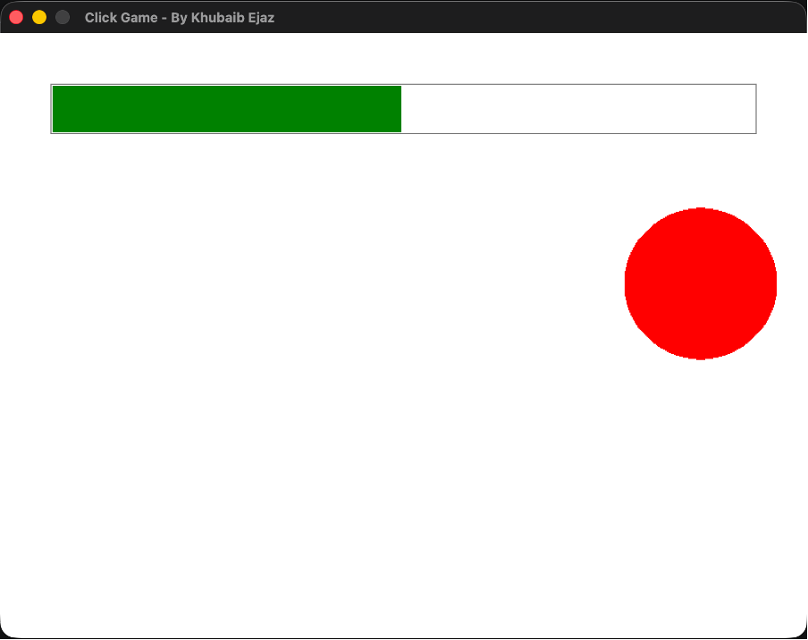

# Click Game

A small reflex game built with C++ and SplashKit. A red target appears at a
random spot on the screen — click it to score a hit. Each hit moves the target
to a new random position and fills the progress bar a little more. Clear the
number of targets you set at the start and you win.

This was one of the first small games I built while learning C++ and the
SplashKit graphics library.





## How it works

- At launch you're asked in the terminal how many targets you want to hit (1–100).
- A window opens with a red circle (the target) and a progress bar across the top.
- Clicking inside the target counts as a hit, respawns it elsewhere, and advances the bar.
- When your hit count reaches the target number, the game prints a congratulations message and closes.

## Controls

| Input | Action |
|-------|--------|
| Left mouse click | Hit the target |
| Close window | Quit |

## Built with

- **C++**
- **SplashKit** — used for the window, drawing, and mouse input

## Running it

You'll need [SplashKit](https://splashkit.io) installed. From inside this folder,
first compile both source files together:
 
```bash
skm clang++ click-game.cpp utilities.cpp -o click-game
```
 
Then run the compiled game:
 
```bash
./click-game
```

> On Windows or Linux you may use `skm g++` instead of `skm clang++`.

## Files

| File | Purpose |
|------|---------|
| `click-game.cpp` | Main game: the loop, target logic, and progress bar |
| `utilities.cpp` / `utilities.h` | Small reusable helpers for terminal input and output |