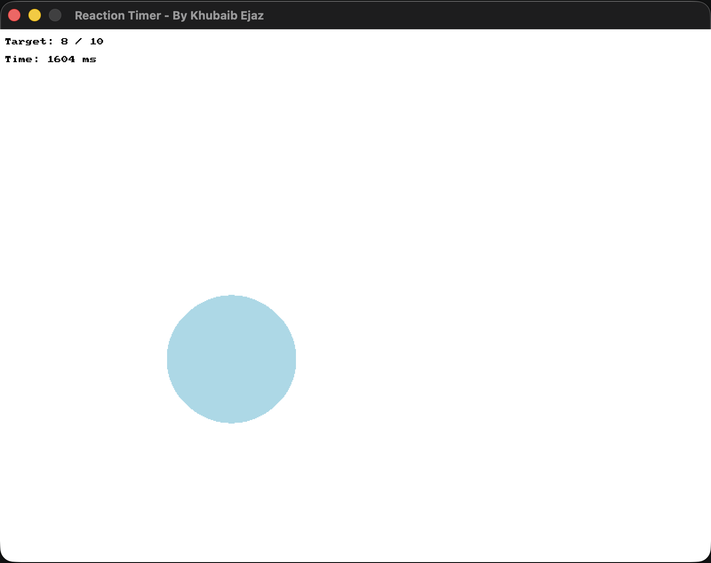

# Reaction Game

A reaction-timing game built with C++ and SplashKit. Targets pop up one at a
time at random positions and sizes — click each one as fast as you can. The game
times every click, and at the end reports your average, best, and worst reaction
times along with a rating.

This was an early project where I first started using **structs** to bundle
related data together, and I later came back to add round limits, per-click
timing, and a results summary.



## How it works

- At launch you're asked in the terminal how many targets you want to hit (1–20).
- A window opens and a light blue target appears at a random spot and size.
- Click the target as fast as you can — it's timed, then a new one appears.
- The window shows your progress (e.g. `Target: 8 / 10`) and a live timer for the current target.
- After the final target, the terminal prints your average, best, and worst times, plus a performance rating.

## Controls

| Input | Action |
|-------|--------|
| Left mouse click | Hit the target |
| Close window | Quit |

## Built with

- **C++**
- **SplashKit** — used for the window, drawing, mouse input, and timing

## Running it

You'll need [SplashKit](https://splashkit.io) installed. From inside this folder,
first compile the source files together:

```bash
skm clang++ reaction-game.cpp utilities.cpp -o reaction-game
```

Then run the compiled game:

```bash
./reaction-game
```

> On Windows or Linux you may use `skm g++` instead of `skm clang++`.

## Files

| File | Purpose |
|------|---------|
| `reaction-game.cpp` | Main game: targets, timing, and the stats summary |
| `utilities.cpp` / `utilities.h` | Small reusable helpers for terminal input |