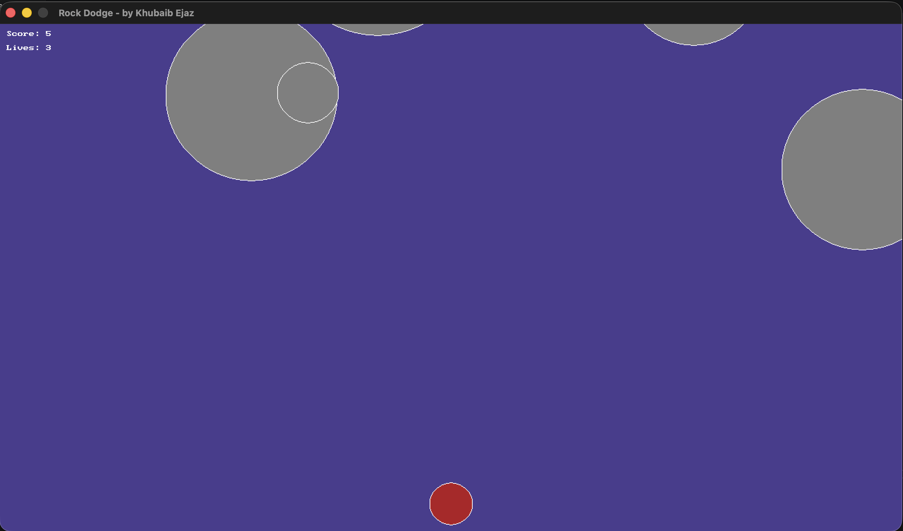

# Rock Dodge

An arcade dodging game built with C++ and SplashKit. Rocks fall from the top of
the screen at random sizes and speeds — move left and right to avoid them. You
have three lives, and your score climbs the longer you survive and the more
rocks you dodge. Run out of lives and it's game over.

This was the most involved of my early games — the first where I used an
**array of structs** to keep track of many rocks at once, along with collision
detection and a game-over screen.



## How it works

- Rocks spawn above the screen at random positions, sizes, and speeds, then fall downward.
- Move your player left and right to dodge them.
- Dodging a rock off the bottom of the screen adds to your score — bigger rocks are worth more.
- Colliding with a rock costs a life. You start with three.
- When your lives reach zero, a game-over screen shows your final score.

## Controls

| Input | Action |
|-------|--------|
| Left arrow | Move left |
| Right arrow | Move right |
| Close window | Quit |

## Built with

- **C++**
- **SplashKit** — used for the window, drawing, keyboard input, and timing

## Running it

You'll need [SplashKit](https://splashkit.io) installed. From inside this folder,
first compile the source file:

```bash
skm clang++ rock-dodge-game.cpp -o rock-dodge-game
```

Then run the compiled game:

```bash
./rock-dodge-game
```

> On Windows or Linux you may use `skm g++` instead of `skm clang++`.

## Files

| File | Purpose |
|------|---------|
| `rock-dodge-game.cpp` | The whole game: rocks, player, collision, scoring, and the game-over screen |